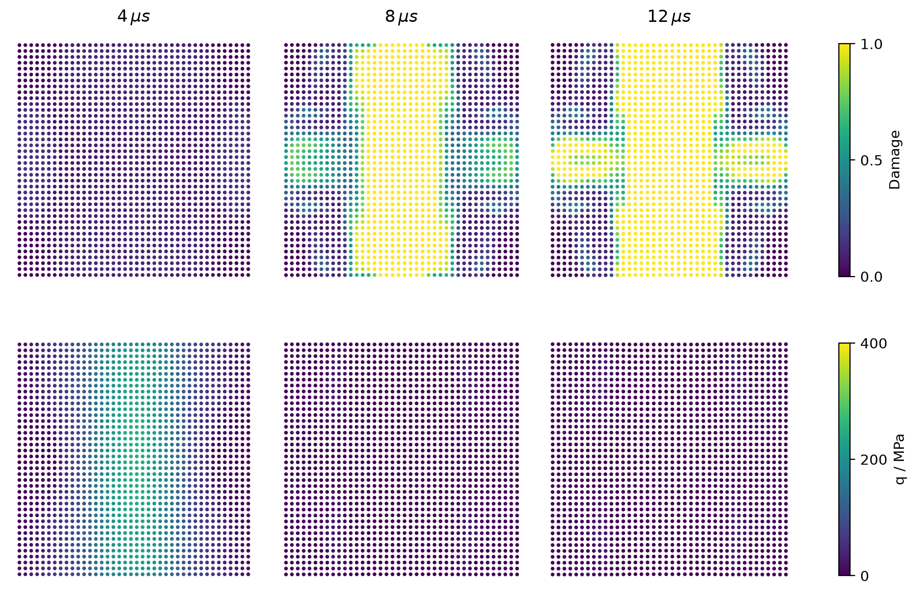
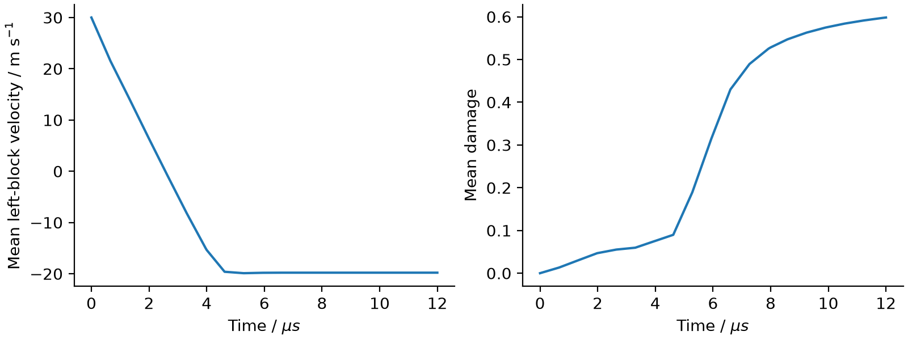
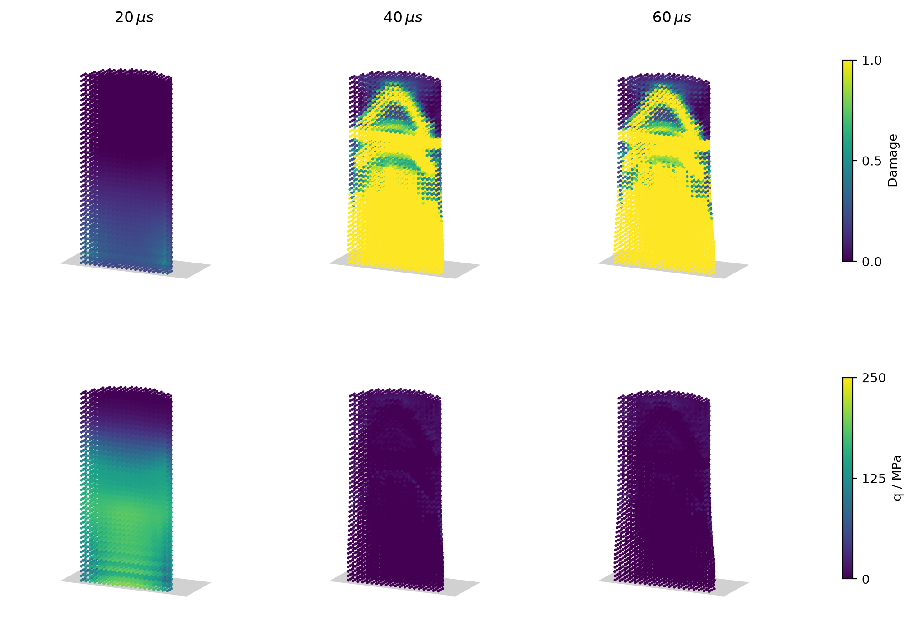
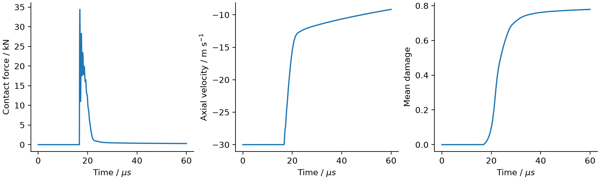

.. _hjc_impact:

Concrete impact with the HJC model
==================================

This example extends the solid mechanics workflow used for colliding elastic
bodies to pressure-dependent plasticity, irreversible compaction and damage.
Two initially adjacent concrete blocks, each 10 mm by 20 mm, move towards
one another at 30 m/s. The calculation is two-dimensional plane strain,
including the out-of-plane normal stress. Mass and energy are per unit thickness.
The parameter set is illustrative and is not an experimental calibration.

Run and plot the example with::

    pysph run solid_mech.hjc_impact --directory hjc_output

The example writes particle snapshots, ``response.csv``, ``damage.png`` and
``response.png``. The built-in PySPH viewer can also display ``damage``, ``q``,
``p``, ``plastic_strain`` and ``plastic_volume``. Use ``--spacing`` in metres
and ``--timestep`` in seconds for resolution studies. The default spacing is
0.5 mm; the default end time is 12 microseconds. The example rejects nonfinite
states, nonpositive density, out-of-range damage and acoustic CFL above 0.2.

The top row shows damage and the bottom row shows equivalent stress. Each row
uses one fixed colour scale. Particle values are drawn at their actual positions,
without field smoothing or displacement amplification.

Three-dimensional Taylor impact
-------------------------------

The companion example launches a concrete cylinder against a rigid plane::

    pysph run solid_mech.hjc_taylor_bar --directory hjc_taylor

The cylinder is 10 mm in diameter and 20 mm long. It starts with a 0.5 mm
surface gap above the plane at z=0 and an axial velocity of -30 m/s. The same
HJC parameters are used as in the block example. The default spacing is
0.5 mm (12,640 particles), and the end time is 60 microseconds. This is a full
three-dimensional calculation, not a plane-strain or axisymmetric surrogate.
Use ``--spacing .001`` for a small 1,600-particle run. The sampled cylinder
volume changes slightly with spacing, while its nominal dimensions and initial
surface gap remain fixed.

The cloud retains the y >= 0 half to expose the interior. Particle colours and
positions are unfiltered; no displacement magnification or depth-dependent
colour shading is applied. The gray plane marks the rigid wall. Damage and
equivalent stress each use a fixed colour range across the three times.

The example's ``RigidPlaneContact`` equation applies the normal acceleration

.. math::

   a_z^{wall} = k_w\max(0,\Delta x/2-z),\qquad
   k_w = \alpha_w(c_L/\Delta x)^2.

Particles have nominal contact radius :math:`\Delta x/2`. The plane exerts no
tangential force, attraction or damping; its default stiffness multiplier is
``--wall-factor 1``. This finite penalty permits a small overlap and is not a
hard position or velocity clamp. The default time step is the smaller of the
acoustic and contact limits, each with factor 0.1. The runtime checks enforce
positive density, bounded damage, a contact/acoustic step factor below 0.2,
and overlap below 10% of particle spacing.

``history.csv`` stores the midpoint contact force used by the corrector at
``force_time`` and the updated response at ``time``. The wall impulse is the
sum of those forces times their actual time steps; ``momentum_residual`` is
the change in axial momentum minus that impulse. ``case.json`` records the
geometry, spacing, speed and wall stiffness. The saved particle files can be
viewed with PySPH. The plotting code also writes ``damage.png`` and
``response.png`` using NumPy and Matplotlib. Histories currently require a
single process; OpenMP may be enabled with ``--openmp``.

Check ``--timestep``, ``--spacing`` and ``--wall-factor`` independently before
using contact forces or local damage quantitatively. The plane equation has
a compiled single-particle test against harmonic contact and free rebound,
including its contact impulse and absence of tangential force. This example
illustrates HJC integration under impact; it is not a calibrated Taylor-test
benchmark or a model of erosion and fragmentation.

At 1 mm spacing and the same 20.4623 ns time step, increasing the wall factor
from 1 to 2 changes the peak force from 34.66 to 47.57 kN, while final mean
damage changes from 0.7763 to 0.7733. The force spike is therefore sensitive to
the finite penalty and must not be interpreted as a calibrated material
prediction. Maximum overlap in these two runs is 0.680% and 0.463% of spacing,
respectively. The default illustrates one specified contact treatment.

At 0.5 mm spacing, reducing the time step from 10.2311 ns to 5.11556 ns gives
peak-normalized RMS differences of 0.0253% in contact force, 0.0148% in mean
axial velocity and 0.0133% in mean damage, relative to the default curves.
The final particle damage differs by 0.00208 RMS and 0.0232 maximum. Both
runs maintain positive density and nondecreasing particle damage to
60 microseconds. Force comparisons use its midpoint evaluation times.

The 0.5 mm run reaches 60 microseconds with a maximum overlap of 0.679% of
spacing. Its momentum-impulse residual stays below 2e-15 of the initial
momentum magnitude. Compared with 1 mm spacing, the peak-normalized RMS
differences are 5.59% in contact force, 4.95% in mean velocity and 2.98% in
mean damage, using each run's default time step. Final mean axial velocity
changes from -6.854 to -9.165 m/s. These are spatial-sensitivity results;
they do not establish convergence of local damage. Curves are interpolated
to a common 1,201-point time grid; RMS differences are divided by the maximum
absolute value of the original 1 mm curve.

Material and integration
------------------------

``hjc_parameters`` validates the material constants and
``get_particle_array_hjc`` allocates the history variables. Use ``HJCStep`` with
``EPECIntegrator`` and the existing ``HookesDeviatoricStressRate``, velocity
gradient, continuity and stress momentum equations. Pressure and sound speed
are updated by the stepper; a separate EOS or plasticity equation must not
overwrite them. The example uses the existing artificial viscosity and
artificial stress. The Cython CPU backend is exercised by the tests.

The normalized compressive strength is

.. math::

   q_y/f_c = \min\{S_{\max}, [A(1-D)+B(p/f_c)^N]
                    [1+C\ln\max(1,\dot\epsilon_{eq}/\dot\epsilon_0)]\}.

In tension the strength term is :math:`A\max(0,1-D+p/T)`. Pressure is positive
in compression and is bounded below by :math:`-T(1-D)`. The equivalent rate
uses the deviatoric symmetric velocity gradient. The reference rate provides
a quasi-static floor. The radial return uses the damage at the start of the
step, then advances damage by

.. math::

   \Delta D = \frac{\Delta\epsilon^p_{eq}+\Delta\mu_p}
    {\max\{\epsilon_{f,\min},D_1[\max(0,(p+T)/f_c)]^{D_2}\}}.

Damage starts at zero, remains in [0, 1], and never decreases. The minimum
fracture strain is a denominator floor, so unconfined plastic shear can cause
damage. Equivalent plastic strain continues to accumulate after cohesion
vanishes. The tensile pressure bound is reapplied using the new damage.
Both predictor and corrector start from saved histories, so intermediate
evaluations cannot accumulate damage twice. Softening is explicit and requires
time-step refinement; the complete material update is not claimed second order.
The existing Jaumann stress rate handles rotation with its usual time-discretization
error. The tests include a finite rigid rotation and all three shear components.

The three-region EOS uses compression :math:`\mu=\rho/\rho_0-1`. Initially its
bulk modulus is ``pc/muc``. The crushing line joins ``(muc, pc)`` to the point
where the dense polynomial reaches ``pl``. In that polynomial,
:math:`p=K_1\eta+K_2\eta^2+K_3\eta^3`, with
:math:`\eta=(\mu-\mu_l)/(1+\mu_l)`. Here ``mul`` is the permanent compaction
offset at locking, not the total locking compression. Partial compaction
interpolates linearly with maximum attained compression; unloading joins its
permanent offset to the previous maximum pressure. Fully compacted material
follows the reversible dense polynomial, extended linearly in tension. This
explicit interpolation convention keeps both EOS joins continuous. The sound
speed bound includes dense stiffening and unloading from previous compression.
The validated parameter domain requires nonnegative ``K2`` and ``K3`` and a
crushing slope below both elastic unloading slopes.

Verification and scope
----------------------

Run the material and compiled integration tests with::

    pytest pysph/sph/tests/test_hjc.py

These check elastic pressure, plastic shear at zero pressure, a closed-form
shear-softening solution, rate strengthening, the strength cap, tensile cutoff,
crushing/unloading, EOS continuity, stage-history handling and rigid rotation.
Time-step and spacing comparisons of the impact should accompany any new
parameter set. Agreement of mean response curves does not establish convergence
of local damage patterns.

For the default 1,600-particle block impact, reducing the time step from 6.60966 ns
to 3.305 ns gives peak-normalized RMS differences of 0.00695% in mean left-block
velocity and 0.0198% in mean damage. The final particle damage differs by
0.000756 RMS and 0.00513 maximum. Both runs reach 12 microseconds with positive
density and nondecreasing particle damage.

At 0.25 mm spacing (6,400 particles), the corresponding RMS differences from
the default are 2.00% in velocity and 8.18% in mean damage; final mean damage
changes from 0.5982 to 0.5034. This is spatial sensitivity, not a converged
fracture prediction. The images above use the default 0.5 mm run. RMS values
use linear interpolation to a common time grid and the default curve's maximum
absolute value as the normalization. Net momentum residuals are below
1e-15 of the initial sum of absolute particle momenta in these serial runs.

This is a local damage model. Damaged particles remain in the calculation and
retain pressure-dependent confined strength. Crack opening, particle erosion,
fracture-energy regularization and thermal effects are not included. The
pressure bound does not introduce a separate hydrostatic tensile cracking law.
The block impact uses the existing SPH interaction between contacting bodies.
Both examples demonstrate constitutive integration without experimental
calibration of the fracture response.

References
----------

* Holmquist, T. J., Johnson, G. R., and Cook, W. H. (1993).
  *A computational constitutive model for concrete subjected to large strains,
  high strain rates, and high pressures*. Proceedings of the 14th International
  Symposium on Ballistics, Quebec, pp. 591--600.
* Meyer, C. S. (2011). `Development of Geomaterial Parameters for Numerical
  Simulations Using the Holmquist-Johnson-Cook Constitutive Model for Concrete
  <https://www.govinfo.gov/content/pkg/GOVPUB-D101-PURL-gpo10967/pdf/GOVPUB-D101-PURL-gpo10967.pdf>`_.
  ARL-TR-5556, pp. 2--7, particularly the fracture-strain lower bound in
  equations (2)--(3).
* Taylor, G. I. (1948). `The use of flat-ended projectiles for determining
  dynamic yield stress. I. Theoretical considerations
  <https://doi.org/10.1098/rspa.1948.0081>`_. Proceedings of the Royal Society A,
  194, pp. 289--299. This is the source of the cylinder-impact geometry; the
  present concrete example does not reproduce the paper's metal experiments.
